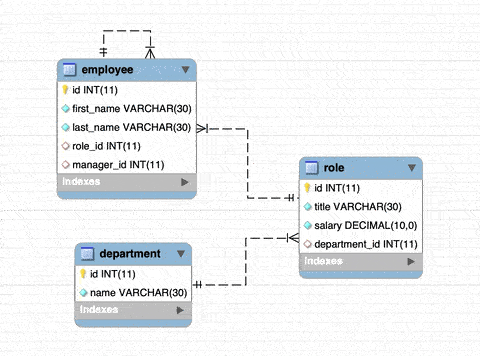

# hw-12: MySQL Homework: Employee Tracker

Assignment: Architect and build a solution for managing a company's employees using node, inquirer, and MySQL.

To run: `npm start`

## Minimum Requirements
* [x] Functional application.
* [x] GitHub repository with a unique name and a README describing the project.
* The command-line application should allow users to:
  * [x] Add employees, departments, roles
  * [x] View employees, departments, roles
  * [x] Update employee roles

## Bonus
* The command-line application should allow users to:
  * [x] Update employee managers
  * [x] View employees by manager
  * [ ] Delete departments, roles, and employees
  * [ ] View the total utilized budget of a department -- ie the combined salaries of all employees in that department

## Submission on BCS
* [x] The URL of the GitHub repository

## ERR

